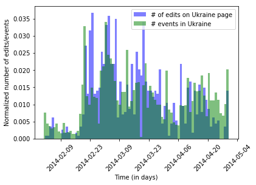

# *Wikipedia Changes and World Events*

#### EPFL, ADA 2017

##### Authors: George Abi Younes, Amaury Combes, Patryk Oleniuk

**report [report.pdf](https://github.com/patryk-oleniuk-epfl/data-analysis-project/blob/master/report/wikipedia-world-events.pdf) 
notebook [Final-notebook.ipynb](https://github.com/patryk-oleniuk-epfl/data-analysis-project/blob/master/Final-notebook.ipynb)** 

## Abstract

Looking at recent events, we noticed that entities 
Browsing some wikipedia pages, we noticed that actors involved in main events (e.g. Carles Puigdemont during the Barcelona crisis) get their english wikipedia page updated many times in a short amount of time after the event. Thus, we would like to use Wikipedia datasets, showing changes in Wikipedia pages, and combine it with events datasets, such as conflict, natural disaster or important news. We’re planning to use only english speaking wikipedia and mainly the number of changes and its timestamps, not the content itself. The goal of the project is to correlate the traffic and number of changes for the pages related to the event with the event time (from events dataset). In addition to this, we’re planning to analyse how deep in the event related pages’ network the changes are done and if these characteristics vary by time or country. By analysing different features for different types of event, we could even try to predict the events happening just by looking at the wikipedia statistics. Below we present the example Ukraine Statics, proving that the wikipedia changes are correlated with the events during the war in Donbass.

## Research questions
A list of research questions you would like to address during the project.

1. Is the number of changes in country-clustered Wikipedia information a good indicator of stability of the country? Could we try do estimate the stability of a country by this factor ? 

2. How often do citizens contribute to Wikipedia and does it depend on the countries' wealth?

3. Which type of events cause the most changes in Wikipedia? 

4. Which countries react very frequent and on-time with putting events in their Wikipedia page?

## Datasets

##### Wikipedia:
1. Wikipedia API (requests) for countries national wikipedia in English.

##### Event data:

2. GDELT, link : https://www.gdeltproject.org/data.html#rawdatafiles
3. Our own knowledge (Barcelona leaving Spain, UK leaving EU, general stability of the countries)

## Responsibilities

**Patryk:** Stability metric #1, Correlation, Maps, Google Cloud "Big Data" 
(GDELT)  processing. 
**Amaury:** Idea and proof-of-concept, Wiki History class, Stability metric #2. 
**George:** Data Analysis, Report and Work on the final presentation. 
